# CUDA Kernel Lab: Build Specification v2 (merges 02 Matrix Operations Library and 07 GPU-Based Matrix Operations)

## 0. How to use this document

Paste this entire file as the opening message of a fresh Claude Code session in an empty project folder on the target machine (Section 3). It is a direct instruction to that agent. Work through the phases in Section 16 in order; never mark a phase complete without actually running its checks and showing output. Keep `PROGRESS.md` at the repo root with a short entry per phase (built, verified, still open). Use git from the first command, one commit per meaningful unit.

This spec supersedes the two older documents it merges. The old MatVec ladder, the tile-size sweep, the GEMM ladder, GEMV, TRSM, SpMV, cuSOLVER, NVML telemetry, and the roofline profiler all live here as one library with one benchmark harness and one report. Tool ecosystems move fast: where this document names a package or install command, treat it as a strong default, confirm it is still current, and note substitutions in `PROGRESS.md` and the engineering log.

## 1. Aim and objectives

**Aim.** Build a CUDA kernel library whose GEMM path is driven, through explicit optimization steps and Nsight Compute diagnostic rounds, from a naive baseline to a compute bound tensor core kernel that lands close to cuBLAS on this machine, with every step measured against cuBLAS on the same GPU and nothing else.

**Objectives.**

1. GEMM ladder with a diagnostic round after every rung: naive, shared memory tiled, register blocked plus vectorized loads, double buffered with `cp.async`, WMMA tensor core (FP16 and BF16 storage, FP32 accumulate), then an `mma.sync` PTX level variant and a CUTLASS backed variant as the reference implementation of the same techniques. The optimization loop for the top kernel does not stop until the kernel is measurably compute bound (Section 8.1 gate) and either reaches at least 90 percent of cuBLAS on one large benchmark shape per precision or the remaining gap is diagnosed in writing from profiler evidence after the budgeted rounds.
2. Supporting kernel families, each correct and benchmarked: GEMV (naive, warp reduced, vectorized; documented as memory bound with roofline evidence), TRSM (naive substitution and blocked on top of the GEMM core), CSR SpMV (naive and warp per row against cuSPARSE), and an RAII cuSOLVER wrapper (LU and Cholesky with residual verified solves).
3. Comparison policy: every performance claim is my kernel versus cuBLAS (or cuSPARSE for SpMV) measured on this RTX 5070. No cross GPU comparisons, no H100 numbers, no quoted results from other machines anywhere in the repo or report.
4. A roofline profiler (analytical plus Nsight Compute empirical mode) used to justify, in writing, the tile configuration, the compute bound claim, and at least one epilogue fusion decision.
5. NVML telemetry sampled on a background thread during every sweep, reviewed for throttling before any number is accepted.
6. Ship at professional standard: tests, docs, CI, main report PDF, debug report PDF, everything reproducible with `make all` from a clean clone.

## 2. Estimated runtime

**ESTIMATED RUNTIME OF THE FULL BENCHMARK SWEEP (ALL FAMILIES, ALL VARIANTS, SIZES 256 TO 8192, 20 TIMED REPS EACH, NVML SAMPLING ON): 30 TO 60 MINUTES ON THE TARGET MACHINE.**

**ESTIMATED RUNTIME OF ONE GEMM DIAGNOSTIC ROUND (NCU FULL SET ON 3 SHAPES PLUS ANALYSIS): 10 TO 20 MINUTES; BUDGET 6 TO 10 ROUNDS ACROSS THE PROJECT.**

**ESTIMATED RUNTIME OF `make all` FROM A CLEAN TREE (BUILD + TESTS + DEFAULT SWEEP + REPORT): 1 TO 2 HOURS.**

**ESTIMATED BUILD EFFORT FOR THE AGENT: 8 TO 12 WORKING SESSIONS; THE TENSOR CORE AND PTX PHASES DOMINATE.**

Estimates, not measurements. Time the first sweep, print a projected total, and replace these numbers in the README with measured wall clock.

## 3. Target machine and environment strategy

| Component | Spec |
|---|---|
| CPU | Intel Core i7-14700K, 20 cores, 28 threads (8 P plus 12 E) |
| RAM | 32 GB DDR5-5600, about 10 GB realistically free under Windows load |
| GPU | NVIDIA GeForce RTX 5070, 12 GB GDDR7, Blackwell GB205, compute capability 12.0 (`sm_120`), 48 SMs, 6144 CUDA cores, 192 fifth generation tensor cores, 192 bit bus at about 672 GB/s |
| Storage | about 100 GB free; keep repo plus results under 10 GB |
| OS | Windows 11 Pro; build and run inside WSL2 Ubuntu |

**Toolchain floors, verified or upgraded at Phase 0:** CUDA Toolkit 13.3 (`sm_120` codegen exists from CUDA 12.8; 13.3 is what this machine runs), CMake 4.4, GCC 16.1 host compiler, C++23 for host code (`CMAKE_CUDA_STANDARD` set to the newest level the installed nvcc accepts for device code; if that is below 23, record it in `PROGRESS.md` rather than silently downgrading host code), CUTLASS current release fetched via CMake FetchContent, Nsight Compute and Nsight Systems from the CUDA toolkit on PATH. If the WSL image has older GCC or CMake, install the newer ones first (Ubuntu toolchain PPA or Kitware apt repo) and record versions. Treat the GPU table as a starting point: at Phase 0 print `cudaGetDeviceProperties` and `nvidia-smi` output and use measured values everywhere the roofline needs a ceiling; if measurement disagrees with the table, trust the machine.

WSL2 profiling note: `ncu` needs the driver's counter permission (`NVreg_RestrictProfilingToAdminUsers=0` equivalent is handled by recent drivers for WSL; verify at Phase 0 by profiling a trivial kernel). If counters are refused, fix that before Phase 3, because the diagnostic rounds are the core of this project.

## 4. Ground rules

1. **No em dashes and no en dashes, anywhere, ever** (U+2014, U+2013), in any file: CUDA, C++, Python, CMake, markdown, LaTeX, commit messages. **LaTeX trap:** `--` and `---` typeset as dashes, so never type them in `.tex` prose; write ranges as "256 to 8192". Enforce with `scripts/check_no_dashes.py` built in Phase 0 (scans tracked text for U+2013/U+2014, scans `.tex` for `--`/`---` outside verbatim), wired into `make check-style` and the report build.
2. **Reproducibility is a deliverable.** Clean `git clone` then `make setup && make all` reproduces every number; nothing hand copied into any document. Every results row carries the git commit hash that produced it.
3. **No number without a run.** No benchmark figure, speedup, or percent of cuBLAS appears anywhere unless produced by this code on this machine and traceable to a results file. Unfilled values read "pending".
4. **Honest baselines.** The naive kernel is a fair first pass (one thread per output element, natural indexing), not a strawman crippled to inflate speedups.
5. **Write as the repo owner.** First person, varied sentence length, no AI stock phrases (leverage, seamless, robust, delve, dive into, cutting edge, furthermore, moreover, in conclusion), comments only where the code cannot say it. Plain present tense commit messages. No TODOs or stubs in shipped files. MIT license, sole author Olajide Badejo.

## 5. Background and design choices (and why)

- **Ladder before library.** Each GEMM variant exists to isolate one technique so the benchmark table attributes gains to causes: shared memory tiling cuts global traffic by the tile factor; register blocking lifts arithmetic intensity per thread; `cp.async` double buffering overlaps global loads with math (Ampere and later asynchronous copy, CUDA C++ Programming Guide); WMMA moves the inner product onto tensor cores; the `mma.sync` PTX variant plus `ldmatrix` removes the WMMA abstraction penalty and exposes fragment layout control (NVIDIA PTX ISA manual). Register blocking as the decisive step over pure tiling follows Volkov and Demmel, "Benchmarking GPUs to Tune Dense Linear Algebra," SC 2008.
- **CUTLASS as reference implementation, not crutch.** A CUTLASS `device::Gemm` instantiation tuned for `sm_120` serves two roles: an upper reference for what template metaprogrammed open source reaches on this card, and a source of technique (its pipelined mainloop structure informs my double buffered and mma variants). My kernels remain hand written; the report compares mine, CUTLASS, and cuBLAS on identical shapes. CUTLASS is NVIDIA's open source CUDA templates library for GEMM (github.com/NVIDIA/cutlass); cite the version used.
- **Compute bound gate defined up front.** A kernel is accepted as compute bound when Nsight Compute's Speed of Light section shows SM pipe utilization clearly above memory system utilization for the tensor path on large shapes, and the kernel's operating point sits right of the ridge on the measured roofline (ridge = measured peak FLOP/s divided by measured bandwidth; Williams, Waterman, Patterson, "Roofline: An Insightful Visual Performance Model for Multicore Architectures," CACM 52(4), 2009). GEMM at large N has arithmetic intensity that grows with N (2MNK FLOPs over roughly 2(MK+KN+MN) words), so failing this gate means the implementation, not the algorithm, is leaving reuse on the table.
- **Diagnostic rounds are the method.** After every rung: run `ncu` (Speed of Light, occupancy, memory workload, warp stall reasons), name the top limiter, state the hypothesis, apply exactly one change, re-measure. Each round is one dated entry in `docs/DIAGNOSTIC_LOG.md` (metric snapshot, hypothesis, change, delta). This log becomes the strongest chapter of the report.
- **Comparison policy rationale.** Percent of cuBLAS on the same device is the only defensible headline for a hand written kernel: it cancels the hardware out of the claim. Cross GPU numbers reappear only if this repo is ever run on another card by someone else, which the reproducibility design permits.
- **GEMV stays off tensor cores** because its arithmetic intensity is fixed near 2 FLOPs per 4 bytes regardless of tiling (every matrix element is used once); it is a bandwidth benchmark in disguise and the docs say so with roofline evidence rather than forcing a tensor variant.
- Verified seed citations (verify anything added): Volkov and Demmel, SC 2008; Williams, Waterman, Patterson, CACM 2009; NVIDIA CUDA C++ Programming Guide (toolkit 13.3 edition); NVIDIA PTX ISA reference (version shipped with 13.3); NVIDIA CUTLASS repository documentation; NVIDIA Blackwell architecture whitepaper for the GPU constants re-verified at Phase 0.

## 6. Repository layout

```text
cuda-kernel-lab/
├── README.md  LICENSE  Makefile  CHANGELOG.md  PROGRESS.md  .gitignore
├── CMakeLists.txt  CMakePresets.json  .clang-format  .clang-tidy
├── cmake/            FindNVML.cmake  CompilerWarnings.cmake
├── include/ckl/
│   ├── gemm.hpp  gemv.hpp  trsm.hpp  sparse.hpp  solver.hpp
│   ├── nvml_monitor.hpp  roofline.hpp  cuda_check.hpp  device_buffer.hpp
│   └── progress.hpp
├── src/
│   ├── gemm/         gemm_naive.cu  gemm_tiled.cu  gemm_register.cu
│   │                 gemm_cp_async.cu  gemm_wmma_fp16.cu  gemm_wmma_bf16.cu
│   │                 gemm_mma_ptx.cu  gemm_cutlass_ref.cu  gemm_dispatch.cu
│   ├── gemv/         gemv_naive.cu  gemv_warp.cu  gemv_vectorized.cu
│   ├── trsm/         trsm_naive.cu  trsm_blocked.cu
│   ├── sparse/       spmv_csr_naive.cu  spmv_csr_warp.cu  cusparse_ref.cpp
│   ├── solver/       dense_solver.cpp
│   ├── telemetry/    nvml_monitor.cpp
│   └── profiler/     roofline.cpp
├── tests/            per family correctness vs cuBLAS/cuSPARSE/CPU, odd shapes
├── benchmarks/       bench_all.cpp  sweep.py  run_ncu_round.sh  run_nsys.sh
├── experiments/      results/ (generated; one committed canonical summary.csv)
├── docs/             building.md  gemm.md  gemv.md  trsm.md  sparse.md
│   ├── cusolver.md  nvml_telemetry.md  roofline_profiler.md  benchmarking.md
│   ├── DIAGNOSTIC_LOG.md  DESIGN_DECISIONS.md  ENGINEERING_LOG.md
├── report/           main.tex  refs.bib  chapters/  figures/  tables/  build/
├── report_debug/     debug_report.tex  sections/  Makefile
├── scripts/          check_no_dashes.py  gen_report_assets.py
└── .github/workflows/ci.yml
```

## 7. State management and reproducibility

- `benchmarks/sweep.py` resolves a declared sweep matrix (families, variants, shapes, dtypes); each configuration's timing lands in `experiments/results/` as JSONL rows carrying shape, variant, dtype, tile config, median and IQR over 20 timed reps after 5 warmups (CUDA events), achieved GFLOP/s, percent of the cuBLAS baseline measured in the same process, NVML summary (median clock, max temp, throttle flags), toolkit and driver versions, and the git commit hash.
- **Resumable sweep:** existing (variant, shape, dtype, commit) rows are skipped on rerun; `--force` redoes. A killed sweep resumes without repeating finished work.
- Diagnostic artifacts: each `run_ncu_round.sh` invocation writes `ncu` reports into a dated `experiments/results/ncu/<round>/` directory referenced by the matching `DIAGNOSTIC_LOG.md` entry, so every claim in the log points at a file.
- `gen_report_assets.py` is idempotent: same summary data, same figures and booktabs tables. Matrices are seeded; seeds recorded per row.

## 8. Component specifications

### 8.1 GEMM ladder and the optimization loop

Variants in order: naive; tiled (shared memory staging, padding against bank conflicts); register blocked (start 128x128x32 block, 8x8 thread tile, `float4` loads; tile parameters templated and swept); `cp.async` double buffered; WMMA FP16 and BF16 (16x16x16 fragments, FP32 accumulate); `mma.sync` PTX with `ldmatrix` fragment loads; CUTLASS reference instantiation. Dispatcher picks by dtype and size; tolerance gates: FP32 relative Frobenius error under 1e-4 versus cuBLAS; FP16/BF16 tolerance derived empirically from the error distribution across representative shapes and written down in `docs/gemm.md`.

The loop that matters: after each variant (and repeatedly on the top variant), one diagnostic round as defined in Section 5. Stop condition for the tensor path: the compute bound gate passes AND (at least 90 percent of cuBLAS at 4096 cubed and 8192 cubed for that precision, OR ten total rounds on the top kernel with the remaining gap attributed in the log to named causes with metric evidence). Kernel complexity is unbounded; correctness gates and the diagnostic log are the guardrails.

### 8.2 GEMV, TRSM, SpMV, cuSOLVER

GEMV: naive (thread per row), warp per row with `__shfl_down_sync` reduction, vectorized (`float4`/`half2`, multiple rows per block). TRSM: naive substitution, then blocked (32 wide diagonal blocks solved directly, off diagonal updates delegated to the GEMM core, mirroring how BLAS libraries reduce TRSM to GEMM). SpMV: CSR naive and warp per row, tested on a skewed degree distribution matrix (uniform rows would hide the load imbalance the warp variant fixes), cuSPARSE `cusparseSpMV` as oracle and baseline. cuSOLVER: RAII `DenseSolver` wrapping `getrf/getrs` and `potrf/potrs` with `_bufferSize` workspace queries; done means residual norm checks pass, not merely no CUDA error.

### 8.3 Roofline profiler and NVML telemetry

Analytical mode from closed form FLOP and byte counts per variant; empirical mode from `ncu` metrics (query current metric names with `ncu --query-metrics` at Phase 0 rather than hardcoding). Output: log log roofline with measured bandwidth diagonal, measured FP32 and tensor ceilings, every variant plotted, ridge point marked. Used, in writing, for: the tile choice, the compute bound claim, and one epilogue fusion (bias add or elementwise epilogue folded into GEMM, before and after intensity and time). NVML monitor samples power, clocks, temperature, utilization at 20 to 50 ms on a background thread during every benchmark; sweeps with throttle flags are rerun after cooldown rather than reported.

## 9. Terminal progress reporting

`sweep.py` runs a `tqdm` bar over configurations (percent, completed/total, elapsed, ETA, current variant and shape) and prints a projected total up front. The C++ bench binary prints `[step k/n]` per configuration via `progress.hpp` (percent plus ETA). `gen_report_assets.py` runs `tqdm` over figures and tables. Bars are TTY aware and fall back to plain lines in CI logs.

## 10. Testing requirements (phase gates)

| Level | What | Gate |
|---|---|---|
| Unit | device buffer RAII, event timer sanity, CPU double precision reference on small shapes | Phase 1 |
| Correctness | every GEMM variant vs cuBLAS on at least five shapes including non square, non tile aligned, smaller than one tile, and a zero dimension | each GEMM phase |
| Family correctness | GEMV/TRSM/SpMV/solver oracles per Section 8.2 | Phases 6 to 8 |
| Diagnostic | one completed ncu round logged per ladder rung | Phases 2 to 5 |
| Compute bound | Section 8.1 gate on the top tensor kernel | Phase 5 |
| Sweep | full sweep completes, JSONL populated, no throttle flagged rows | Phase 9 |
| Style | `check_no_dashes.py` zero hits | every phase |

## 11. Style rules

C++/CUDA: `snake_case` functions and files, `PascalCase` types, `UPPER_SNAKE` constants and template tile parameters, trailing underscore members; kernels named `<op>_<variant>`; `.cu`/`.cuh` device, `.cpp`/`.hpp` host. `-Wall -Wextra -Wpedantic` clean plus matching nvcc flags; zero warnings is a gate. clang-format and clang-tidy configs committed and enforced in CI. Python: `snake_case`, `ruff` clean. Prose voice per Section 4 rule 5.

## 12. Documentation set

README (what and why, quick start, measured headline table added last, link to both PDFs), one doc per component under `docs/` explaining choices and pointing at source rather than restating it, `DIAGNOSTIC_LOG.md` (the round by round record), `DESIGN_DECISIONS.md`, `ENGINEERING_LOG.md` (dated problems as they happen), CHANGELOG, CONTRIBUTING (states which tests need real hardware).

## 13. Main report pipeline

`report/main.tex`, chapters: introduction, background (roofline model, Blackwell tensor pipeline, GEMM blocking theory), methodology (timing protocol, diagnostic round protocol, comparison policy), GEMM design and optimization narrative (built from the diagnostic log), supporting families, roofline analysis, results (all figures and booktabs tables generated from the JSONL by `gen_report_assets.py`), discussion, conclusion. `refs.bib` carries the Section 5 citations. Built with `latexmk -pdf -interaction=nonstopmode -output-directory=build` from `make report` inside WSL (install `texlive-latex-extra latexmk` at Phase 0; MiKTeX `texify` on Windows is the documented fallback), asset regeneration first, dash check last.

## 14. Engineering log and debug report (second PDF)

`docs/ENGINEERING_LOG.md` from Phase 0: dated entries per real problem (a wrong lda in the WMMA load, an occupancy collapse from register pressure, a cp.async alignment fault, an ncu permission fight in WSL), each with symptom, root cause, options, chosen fix and why, commit, verification. At Phase 10 convert into `report_debug/debug_report.pdf` grouped by theme. The diagnostic rounds that failed (hypothesis wrong, change reverted) belong here; equal rank deliverable, never padded.

## 15. CI

GitHub Actions on ubuntu-latest: install CUDA toolkit (nvcc compiles `sm_120` without a GPU), configure, build with zero warnings, run clang-format and clang-tidy checks, run host only tests, dash check required. GPU execution tests and the sweep are marked as requiring real hardware and skip cleanly in cloud CI; `CONTRIBUTING.md` says so. Report compile job builds both PDFs from the committed canonical summary.

## 16. Roadmap

```mermaid
flowchart LR
    P0[P0 toolchain + GPU probe + dash lint] --> P1[P1 naive GEMM + harness + cuBLAS oracle]
    P1 --> P2[P2 tiled + diagnostic round]
    P2 --> P3[P3 register blocked + round]
    P3 --> P4[P4 cp.async double buffer + round]
    P4 --> P5[P5 WMMA fp16/bf16 + mma.sync PTX + CUTLASS ref + rounds to compute bound]
    P5 --> P6[P6 GEMV family]
    P6 --> P7[P7 TRSM + SpMV]
    P7 --> P8[P8 cuSOLVER + NVML + roofline modes]
    P8 --> P9[P9 full sweep + fusion study]
    P9 --> P10[P10 docs + report + debug report]
    P10 --> P11[P11 final QA: make clean && make all + v1.0.0]
```



Gates per Section 10. Phase 11 requires `make clean && make all` to reproduce everything from scratch with zero manual steps.

## 17. GitHub publication checklist

Repo `cuda-kernel-lab` (consolidates and archives the two older repos; add a pointer README to each old repo after this ships). Description: "CUDA kernel library driven from naive to compute bound tensor core GEMM through logged Nsight diagnostic rounds, benchmarked against cuBLAS on the same GPU, with GEMV, TRSM, CSR SpMV, cuSOLVER integration, and a measured roofline." Topics: `cuda`, `gemm`, `tensor-cores`, `cutlass`, `ptx`, `gpu-computing`, `roofline`, `benchmarking`, `high-performance-computing`. MIT, sole author Olajide Badejo, attribution disabled via `.claude/settings.local.json` (`{"attribution": {"commit": "", "pr": ""}}`) before the first commit, history checked with `git log --all --grep="Co-authored-by"` and `git log --all --grep="Claude"`, `v1.0.0` after DoD with both PDFs attached.

## 18. Definition of done

- [ ] `make all` clean start to finish on a fresh clone; README states measured wall clock
- [ ] Zero dash characters repo wide including compiled PDFs (`make check-style`)
- [ ] Every kernel family passes correctness at its stated tolerance, including odd and degenerate shapes
- [ ] Top tensor kernel passes the compute bound gate; stop condition of Section 8.1 met and documented
- [ ] `DIAGNOSTIC_LOG.md` has one evidence backed entry per round, each pointing at an ncu artifact
- [ ] Full sweep complete with NVML logs reviewed and no throttle flagged rows in the canonical summary
- [ ] Roofline figure generated from measured ceilings; tile choice, compute bound claim, and fusion decision justified in prose
- [ ] Both PDFs compile through the automated pipeline from live results data
- [ ] Zero compiler warnings; clang-format and clang-tidy clean; CI green
- [ ] No cross GPU comparison anywhere; every number traceable to a results file and commit hash; `v1.0.0` tagged
