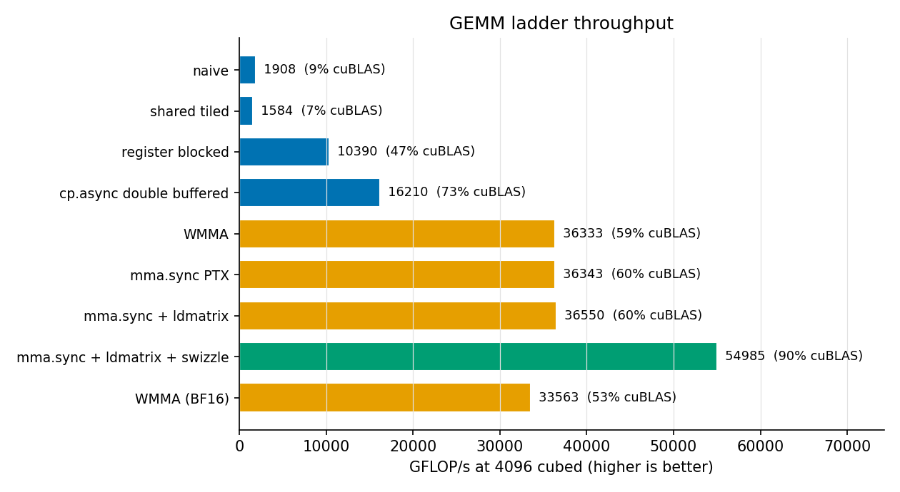
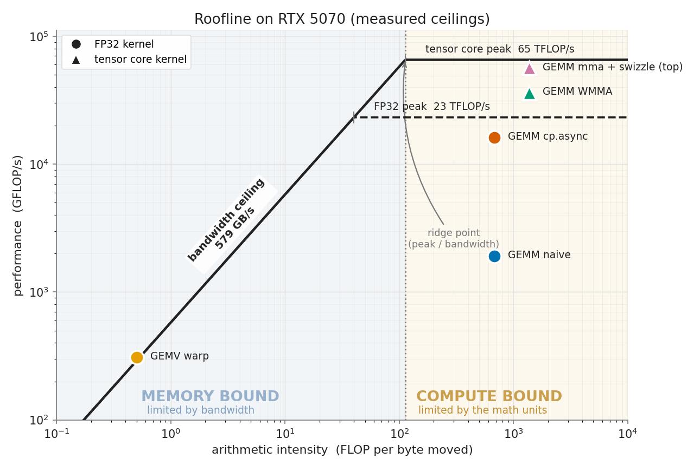
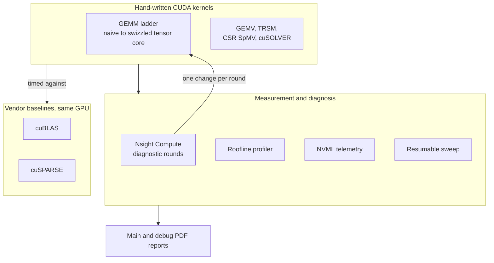

# CUDA Kernel Library

> A hand-written CUDA linear-algebra library, driven from a naive GEMM to a
> **compute-bound tensor-core kernel at about 90% of cuBLAS** on a single NVIDIA
> RTX 5070. Every performance number is my kernel versus the vendor library
> (cuBLAS, or cuSPARSE for sparse) on the **same GPU, in the same process**, and
> every optimization step is justified by Nsight Compute profiling.


-76B900.svg)


**Author: Olajide Badejo**

---

## What this project demonstrates

- A GEMM kernel taken from a fair naive baseline to **compute bound** on the
  Blackwell tensor cores, one profiler-guided change at a time.
- The full optimization toolkit applied for real: shared-memory tiling, register
  blocking, `cp.async` double buffering, WMMA, raw `mma.sync` PTX, `ldmatrix`, and
  a shared-memory **swizzle** that removed 219M bank conflicts and passed the
  compute-bound gate.
- Honest engineering: a plausible optimization that measured *worse* was reverted
  and written up, not hidden.
- A complete supporting library (GEMV, TRSM, CSR SpMV, cuSOLVER), a measured
  roofline, NVML thermal-throttle gating, a resumable benchmark sweep, CI, and two
  automatically generated PDF reports.

## Headline result: the GEMM optimization ladder

Each rung isolates one technique so the speedup can be attributed to a cause. Bar
length is absolute throughput; the percent is of cuBLAS **at the same precision**
(FP32 kernels vs cuBLAS SGEMM, tensor kernels vs cuBLAS FP16/BF16).



The decisive moves: **register blocking** (naive-beating tiling was actually
slower on this cache-rich GPU), then feeding the tensor cores through a **swizzled
shared layout**. The top FP16 kernel reaches **54,985 GFLOP/s = 90% of cuBLAS** at
4096^3 and 90% again at 8192^3.

## The roofline: why each kernel hits its limit

Measured ceilings on this GPU (not the datasheet): ~579 GB/s bandwidth, ~23 TFLOP/s
FP32, ~65 TFLOP/s tensor. GEMM sits far right of the ridge (compute bound); GEMV
sits on the bandwidth diagonal (memory bound), exactly as the model predicts.



The top kernel is **verified compute bound**: Nsight Compute Speed of Light shows
the tensor pipe at 83% against the memory system at 30%.

## Architecture



## Results at a glance (this RTX 5070)

| GEMM rung | precision | GFLOP/s | % of cuBLAS |
|---|---|---|---|
| naive | FP32 | 1,908 | 9 |
| register blocked | FP32 | 10,390 | 47 |
| cp.async double buffered | FP32 | 16,210 | 73 |
| WMMA | FP16 | 36,333 | 59 |
| **mma.sync + ldmatrix + swizzle (top)** | **FP16** | **54,985** | **90** |

| supporting family | best hand-written | baseline | note |
|---|---|---|---|
| GEMV (warp) | ~610 GB/s at 8192 | cuBLAS SGEMV | memory bound, matches cuBLAS |
| CSR SpMV (warp per row) | 1.6x the naive kernel | cuSPARSE | skewed-degree matrix |
| TRSM (blocked) | matches cuBLAS to 1e-7 | cuBLAS STRSM | residual verified |
| cuSOLVER LU / Cholesky | residual 5.6e-7 / 4.3e-7 | vendor path | RAII wrapper |

Full per-shape data with clocks, temperature, and throttle flags:
[`experiments/results/summary.csv`](experiments/results/summary.csv).

## Reports (PDF, open in GitHub's viewer)

- **[Main report](reports/main_report.pdf)** - the design and optimization
  narrative, roofline analysis, and results, generated from the live data.
- **[Debug report](reports/debug_report.pdf)** - the dated engineering log:
  toolchain fights, the WSL2 profiler-permission fix, and the diagnostic round
  that failed and was reverted.

## The method

The core of the project is a loop, not a single kernel. After each rung: run
Nsight Compute, name the top limiter, state a hypothesis, apply **exactly one**
change, re-measure. Nine rounds are recorded in
[`docs/DIAGNOSTIC_LOG.md`](docs/DIAGNOSTIC_LOG.md), each pointing at its `ncu`
report. Percent of cuBLAS on the same device is the only headline used, because it
cancels the hardware out of the claim.

## Reproduce

Requires an NVIDIA GPU with a CUDA 13.3 driver (this repo targets sm_120), built
inside WSL2 Ubuntu.

```sh
make setup      # configure (CMake + Ninja, sm_120)
make build      # compile; zero warnings is a gate
make test       # correctness vs cuBLAS/cuSPARSE/CPU (needs a GPU)
make sweep      # full benchmark sweep -> experiments/results/summary.csv
make roofline   # measure ceilings and render the roofline figure
make report     # regenerate figures/tables and build both PDFs
make all        # build + test + sweep + report + style gate
```

Every result carries the commit that produced it; nothing is hand-copied into the
reports. See [`docs/`](docs/) for per-component notes and
[`PROGRESS.md`](PROGRESS.md) for the phase-by-phase build log.

## Target machine

RTX 5070 (Blackwell GB205, compute capability 12.0, sm_120, 48 SMs, 12 GB GDDR7),
CUDA Toolkit 13.3, GCC 15.2, built and run inside WSL2 Ubuntu. Measured ceilings
are captured at build time by `./build/device_probe` and used everywhere in place
of the datasheet.

## License

MIT, sole author Olajide Badejo. See [LICENSE](LICENSE).
