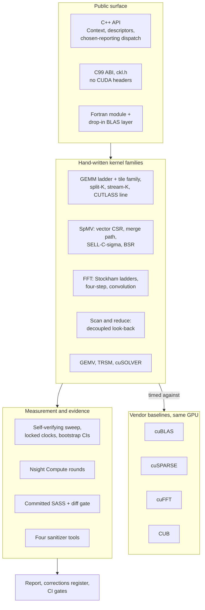

# CUDA Kernel Library 

> A hand-written CUDA linear-algebra library, driven from a naive GEMM to a
> **compute-bound tensor-core kernel** on a single NVIDIA RTX 5070. At a locked
> 2497 MHz graphics clock the top kernel runs at **66.4% of cuBLAS FP16 at 1024^3,
> 86.1% at 2048^3, 94.8% at 4096^3 and 94.8% at 8192^3**, a geometric mean of
> **84.7%** over that range, which is **88.98% and 91.87% of the hardware tensor
> roof** at the two largest shapes. Every performance number is my kernel versus
> the vendor library (cuBLAS, or cuSPARSE for sparse) on the **same GPU, in the
> same process**, and every optimization step is justified by Nsight Compute
> profiling.


-76B900.svg)


**Author: Olajide Badejo**

---

## Using the library

Install it once, then four lines of CMake:

```cmake
find_package(CKL REQUIRED)

add_executable(my_app main.cpp)
target_link_libraries(my_app PRIVATE ckl::ckl)
```

`add_subdirectory` and pkg-config work too, and there is a C99 ABI with no CUDA
headers in it for callers who do not want the toolkit. Integration, a complete
first program, and the load-bearing contracts (synchronous versus asynchronous,
thread safety, alignment, aliasing, error handling, both layout conventions) are
in [`docs/using.md`](docs/using.md). Toolchain and build options are in
[`docs/building.md`](docs/building.md); calling it from Fortran is in
[`docs/fortran.md`](docs/fortran.md). Four runnable programs live in
[`examples/`](examples/).

## What this project demonstrates

- A GEMM kernel taken from a fair naive baseline to **compute bound** on the
  Blackwell tensor cores, one profiler-guided change at a time.
- The full optimization toolkit applied for real: shared-memory tiling, register
  blocking, `cp.async` double buffering, WMMA, raw `mma.sync` PTX, `ldmatrix`, and
  a shared-memory **swizzle** whose effect is on a committed profiler page: 106,296
  bank conflicts against 50.4M shared load wavefronts at 4096^3, and 465,929
  against 403.1M at 8192^3, which is 0.21% and 0.12%.
- Honest engineering: a plausible optimization that measured *worse* was reverted
  and written up, not hidden.
- A real library, not a benchmark tree: `find_package(CKL)`, a pure C99 ABI with
  no CUDA headers, and a Fortran binding whose `SGEMM` drops in for a CPU BLAS.
- Three further hand-tuned families beyond GEMM, each against its correct vendor
  baseline: SpMV over a real SuiteSparse suite (cuSPARSE), FFT convolution
  (cuFFT), and scan and reduction (CUB), plus the supporting GEMV, TRSM, and
  cuSOLVER paths.
- A roofline built on hardware ceilings rather than on a vendor library, NVML
  thermal-throttle gating, a clock-locked self-verifying benchmark sweep,
  committed SASS with a diff gate, CI with no soft gates, and two automatically
  generated PDF reports.
- A corrections register, [`docs/CORRECTIONS.md`](docs/CORRECTIONS.md), where I
  audit my own published claims against my own data and write down what did not
  survive.

## Headline result: the GEMM optimization ladder

Each rung isolates one technique so the speedup can be attributed to a cause. The
chart is percent of cuBLAS against shape, every rung at every swept size, because
a single shape hides the fact that the curve is not flat. The percent is of cuBLAS
**at the same precision** (FP32 kernels vs cuBLAS SGEMM, tensor kernels vs cuBLAS
FP16/BF16), so the two groups are not comparable as absolute speed.


The decisive moves: **register blocking** (naive-beating tiling was actually
slower on this cache-rich GPU), then feeding the tensor cores through a **swizzled
shared layout**. The top FP16 kernel reaches **54,602 GFLOP/s at 4096^3, 94.8% of
cuBLAS**, and 56,375 GFLOP/s at 8192^3, again 94.8%. The curve is not flat: it
climbs from 57.9% at 128^3 through 66.4% at 1024^3 and 86.1% at 2048^3, because
the small shapes cannot fill 48 SMs. The honest single figure is the geometric
mean, 84.7% over 1024^3 to 8192^3 and 71.3% over all eight swept shapes.

The percent above is against `CUBLAS_DEFAULT_MATH` with the default algorithm
selection, which is what a caller gets without asking for anything. cuBLAS is also
measured with its autotuner on, and where that finds a faster kernel the gap
widens: at 4096^3 the autotuned baseline is 59,121 GFLOP/s, so the same kernel is
92.4% rather than 94.8%, and at 8192^3 it is 94.6% rather than 94.8%. The largest
divergence is at 768^3, 69.8% autotuned against 75.4% default. Both baselines are
in `summary.csv` as `baseline_cublas_autotune` and `baseline_cublas_default`.

## The roofline: why each kernel hits its limit

The compute roofs are hardware, not cuBLAS: 48 SMs times the SM clock times 512
FLOP per cycle for FP16 inputs with FP32 accumulate, and 256 FLOP per cycle for
FP32. Roofline and sweep now share one clock: everything below was measured at
the **2497 MHz lock**, where the arithmetic gives a **61.4 TFLOP/s tensor roof**,
a **30.7 TFLOP/s FP32 roof** and a measured **584 GB/s** of streaming bandwidth.
The top kernel lands at **89.0% of that roof**.

cuBLAS is drawn as a separate dashed attainable line, because a vendor library is
a competitor, not a ceiling: it attains **96.2%** of the tensor roof at the same
lock. That agreement is the best evidence I have that 512 FLOP per cycle is the
right figure for this part.

GEMM sits far right of the ridge (compute bound); GEMV sits on the bandwidth
diagonal (memory bound), exactly as the model predicts.


Against the locked-clock roof the top kernel reaches **88.98% at 4096^3 and 91.87%
at 8192^3**. It is **compute bound at 4096^3** on the committed Nsight Compute
page: Compute (SM) Throughput 90.38% against Memory Throughput 26.19%, a ratio of
3.45. At 8192^3 compute is higher still at 92.46%, but memory rises to 70.91% and
the ratio falls to 1.30, which fails the 2x clause of the compute-bound gate. The
cause is measured rather than guessed: the L2 hit rate drops from 95.71% to 48.46%
and DRAM traffic reaches 9.21 GB against 536.9 MB compulsory. See the scoreboard
below.

## Architecture


```mermaid
flowchart TB
    subgraph API["Public surface"]
        CPP["C++ API<br/>Context, descriptors,<br/>chosen-reporting dispatch"]
        C99["C99 ABI, ckl.h<br/>no CUDA headers"]
        F90["Fortran module +<br/>drop-in BLAS layer"]
    end
    subgraph K["Hand-written kernel families"]
        G["GEMM ladder + tile family,<br/>split-K, stream-K, CUTLASS line"]
        SP["SpMV: vector CSR, merge path,<br/>SELL-C-sigma, BSR"]
        FF["FFT: Stockham ladders,<br/>four-step, convolution"]
        SC["Scan and reduce:<br/>decoupled look-back"]
        SUP["GEMV, TRSM, cuSOLVER"]
    end
    subgraph B["Vendor baselines, same GPU"]
        CB["cuBLAS"]
        CS["cuSPARSE"]
        CF["cuFFT"]
        CU["CUB"]
    end
    subgraph H["Measurement and evidence"]
        VER["Self-verifying sweep,<br/>locked clocks, bootstrap CIs"]
        NCU["Nsight Compute rounds"]
        SASS["Committed SASS + diff gate"]
        SAN["Four sanitizer tools"]
    end
    API --> K
    K -->|timed against| B
    K --> H
    H --> R["Report, corrections register,<br/>CI gates"]
```

## Results at a glance (this RTX 5070)

Every number below comes from one sweep: **984 rows** at commit `1155de4`, 982
measured and 2 recorded refusals, five independent process repeats per
configuration with a bootstrap 95% interval, the graphics clock locked at 2500 MHz
and observed at 2497 on 895 rows with the worst drift 1.0% against a 2% gate, and
the vendor baseline measured once per shape in the same process. Shapes are
measured both with L2 flushed and warm, and separately stream launched and graph
launched; the row quoted is the canonical one, which is the flush state the
dispatcher would actually see. The GEMM ladder is at 4096^3, from `summary.csv`:

| GEMM rung | precision | GFLOP/s | % of cuBLAS |
|---|---|---|---|
| naive | FP32 | 1,810 | 8.8 |
| shared tiled | FP32 | 1,455 | 7.1 |
| register blocked | FP32 | 16,378 | 79.4 |
| cp.async double buffered | FP32 | 17,047 | 82.7 |
| WMMA | FP16 | 33,722 | 58.6 |
| mma.sync PTX | FP16 | 33,627 | 58.4 |
| mma.sync + ldmatrix | FP16 | 33,729 | 58.6 |
| **mma.sync + ldmatrix + swizzle (top)** | **FP16** | **54,602** | **94.8** |
| CUTLASS reference line | FP16 | 58,669 | 101.9 |
| WMMA | BF16 | 31,148 | 54.1 |

The shared-tiled rung being *slower* than naive is the most useful line in that
table: on a cache-rich part the optimization everyone reaches for first is a
regression, and it stays on the ladder rather than being quietly dropped.

The tile family is a separate sweep, 98 rows, and it is what the `kAuto` dispatch
heuristic now reads. At 8192^3 the six instantiated tiles land at 91.4% (128x128x32),
87.5% (128x128x64), 86.1% (128x256x32), 84.9% (256x128x32), 80.5% (128x64x64) and
62.9% (64x128x64) of cuBLAS, so tile choice is worth 28 points of cuBLAS on the
same mainloop.

| supporting family | shape | GFLOP/s | % of vendor | baseline | note |
|---|---|---|---|---|---|
| GEMV vectorized | 8192 sq | 294.2 | 99.1 | cuBLAS SGEMV | memory bound |
| GEMV warp | 8192 sq | 290.3 | 97.8 | cuBLAS SGEMV | memory bound |
| TRSM blocked | 2048 x 256 | 322.8 | 24.7 | cuBLAS STRSM | correct to 1e-7, a quarter of the vendor's speed |
| TRSM naive | 2048 x 256 | 8.5 | 0.7 | cuBLAS STRSM | column at a time, kept as the honest baseline |
| cuSOLVER LU / Cholesky | 1024 | not timed | not timed | vendor path | residual 5.6e-7 / 4.3e-7, RAII wrapper |

**SpMV**, over a real SuiteSparse suite plus five synthetic seeds, against cuSPARSE
with its plan built outside the timed region. The suite is where the interesting
results are, because which kernel wins is a property of the matrix: SELL-C-sigma
takes `cant` at 120.8% of cuSPARSE, BSR takes `pdb1HYS` at 148.4%, and the naive
one-thread-per-row kernel takes `mc2depi` at 154.9%. The headline is merge path on
the power-law matrix `webbase-1M`: **5.12x the warp-per-row kernel** (0.116256 ms
against 0.595328 ms, disjoint intervals), which round 15 attributes to lane
utilization, 29.71 of 32 lanes against 19.98, paid for with a gather costing 11.05
sectors per request against 2.70. On `soc-LiveJournal1` the BSR path **refuses to
run** and the row records why: the best block dimension is 2 at a fill of 0.2886,
which would store 239,048,588 values for 68,993,773 nonzeros, past the plan's
134,217,728 entry ceiling. That is a recorded refusal, not a missing measurement,
and the table prints it as `refused` rather than as `pending`.

**FFT and scan**, against cuFFT and CUB:

| rung | size | throughput | % of vendor | % of the 579 GB/s roof |
|---|---|---|---|---|
| FFT radix 8 | 2^24 | 3.721 ms | 38.4 of cuFFT | 95, per pass |
| FFT radix 8 | 2^20 | 0.108 ms | 60.5 of cuFFT | not usable, see below |
| scan decoupled look-back | 2^28 | 550.07 GB/s | 95.5 of CUB | 95.0 |
| reduction single pass | 2^28 | 614.80 GB/s | 100.2 of CUB | reduction reads only |

Convolution is reported as a crossover rather than as a percent, because the direct
and FFT paths compute the same answer with different FLOP counts and comparing
their GFLOP/s compares two models instead of two speeds. On time, at N = 2^22 the
direct path with taps in constant memory beats cuFFT by 23x at a filter length of
8 taps (0.081 ms against 1.860 ms) and loses by 5x at 4096 taps (9.142 ms). The
generated chart reads the crossing out of the committed rows: **M = 777 at N = 2^20
and M = 1522 at N = 2^22**.

The FFT rung is not slow, it is doing too much work: at 2^24 it runs at 95% of the
DRAM roof on every one of its **8 passes**, where cuFFT makes **3**. Measured
traffic is 1977 MB against 744 MB, a factor of 2.66, and the medians are 3.721 ms
against 1.427 ms, a factor of 2.61. Those two ratios agreeing to 2% is the whole
diagnosis: radix 8 is the wrong lever, the number of global passes is the lever.
At 2^20 the effective GB/s of that row is inflated, because the working set fits in
L2 and 45% of the bytes the model counts never reach DRAM, so it is excluded from
roof claims rather than quoted.

### Gate scoreboard

The gates are stated in the build spec and checked clause by clause in
[`docs/DIAGNOSTIC_LOG.md`](docs/DIAGNOSTIC_LOG.md) rounds 12 to 17. Misses are
listed next to the passes with the mechanism named, because a gate that cannot
fail is not a gate.

| gate | result | the miss |
|---|---|---|
| **D**, GEMM compute bound | **5 of 6 clauses pass** | Compute at least 2x Memory Throughput fails at 8192^3: 92.46 against 70.91, ratio 1.30. L2 residency, not the mainloop; the fix is the L2 rasterization swizzle plus a persistence window, which this release did not implement. |
| **S**, SpMV | **one clause failed** | Merge at least 1.5x warp on both power-law matrices: passes on `webbase-1M` at 5.12x, fails on `soc-LiveJournal1` at 1.286x. Not load balance (tail ratio is already 1.02 to 1.05) but the gather, at 11 sectors per request over column indices with no locality left. Block-level tile staging of x is the queued kernel change. |
| **X**, FFT | **three clauses failed** | Traffic within 15% of the declared model fails at 2^20, 45.4% low, because the model has no L2 term. The best hand rung reaches 60.5% at 2^20 and 38.3% at 2^24 against a 70% of cuFFT bar, for the pass-count reason above. And the batched small sizes reach 66.0/65.5/38.2% at 2^10 to 2^12 against an 85% bar, same mechanism. |
| **R**, scan and reduction | **bandwidth passed, CUB parity missed at two sizes** | Both bandwidth clauses pass at every size. Scan within 5% of CUB fails at 2^26 (94.15%) and 2^27 (94.52%) and passes at 2^28 (95.49%). It is tile size, not traffic: look-back carries 2,048 elements per tile against CUB's 7,904, so it pays the handshake 3.9 times more often. Raising items per thread is the tuning change to try. |

One more clause is open rather than failed: the `dram_bytes_sum` column in
`summary.csv` still reads `pending ncu round`. The numbers exist on the round 15 to
17 pages; the column does not hold them yet, and re-summarizing the sweep is what
closes it.

Full per-shape data with clocks, temperature, throttle flags and confidence
intervals: [`experiments/results/summary.csv`](experiments/results/summary.csv)
and [`experiments/results/tile_sweep.csv`](experiments/results/tile_sweep.csv).

## Reports (PDF)

The PDFs are not committed to the tree. They are built from the committed results
files and attached to each GitHub release, so a link here points at the release
asset rather than at a binary in `git`:

- **[main_report.pdf](../../releases/latest)** (attached to the release) - the
  design and optimization narrative, related work, the negative result, the
  numerical accuracy model, roofline analysis, limitations, and a reproducibility
  statement, all generated from the live data.
- **[debug_report.pdf](../../releases/latest)** (attached to the release) - the
  dated engineering log: toolchain fights, the WSL2 profiler-permission fix, the
  diagnostic round that failed and was reverted, and the audit of my own claims.

Build them locally with `make report`, which regenerates every figure and table
from `experiments/results/` and writes `report/build/main.pdf` and
`report/build/debug.pdf`. It needs no GPU and no CUDA toolkit.

## The method

The core of the project is a loop, not a single kernel. After each rung: run
Nsight Compute, name the top limiter, state a hypothesis, apply **exactly one**
change, re-measure. Seventeen rounds are recorded in
[`docs/DIAGNOSTIC_LOG.md`](docs/DIAGNOSTIC_LOG.md), thirteen of them pointing at a
committed `ncu` text page under `experiments/results/ncu/`. Rounds 12 to 17 are
this release's evidence campaign: the top kernel at both large shapes, what cuBLAS
actually dispatches on this part, and one round each for SpMV, FFT and scan, every
one at the locked clock and every gate clause given a verdict. Round 14 is
arithmetic over the round 12 pages and has no capture of its own. Round 5 stays a
gap in the numbering and round 8 is closed as superseded, both explained in the A6
closure in [`docs/CORRECTIONS.md`](docs/CORRECTIONS.md). Percent of
cuBLAS on the same device is the headline used against a vendor library, because
it cancels the hardware out of the claim; the roofline uses the hardware roof
instead, so "percent of roof" and "percent of cuBLAS" stay two different
questions.

## Reproduce

Requires an NVIDIA GPU with a CUDA 13.3 driver (this repo targets sm_120), built
inside WSL2 Ubuntu.

```sh
make setup      # configure (CMake + Ninja, sm_120)
make build      # compile; zero warnings is a gate
make test       # correctness vs cuBLAS/cuSPARSE/CPU (needs a GPU)
make sweep      # full benchmark sweep -> experiments/results/summary.csv
make roofline   # measure the ceilings and render the roofline figure
make report     # regenerate figures/tables and build both PDFs
make all        # build + test + sweep + report + style gate
```

`make sweep` locks the graphics clock before it measures anything and refuses to
run if it cannot, so the rows in a sweep are comparable with each other. Every
result carries the commit that produced it, and `make check-style` runs
`scripts/check_provenance.py`, which fails if any recorded hash no longer resolves
in git. Every row of `summary.csv` and every round from 12 on carries a hash that
resolves. Seven v1 hashes still do not, and they are kept in
`experiments/results/legacy_hashes.txt` because the artifacts they stamp are still
in the tree as history: the 60 superseded rows in `sweep.jsonl` and the round 01 to
09 meta pages. No current claim rests on them; the reason they died is recorded in
[`docs/CORRECTIONS.md`](docs/CORRECTIONS.md). Nothing is hand-copied into the
reports. See [`docs/`](docs/) for per-component notes,
[`docs/DIAGNOSTIC_LOG.md`](docs/DIAGNOSTIC_LOG.md) for the profiling rounds, and
[`docs/ENGINEERING_LOG.md`](docs/ENGINEERING_LOG.md) for the dated build log.

## Target machine

RTX 5070 (Blackwell GB205, compute capability 12.0, sm_120, 48 SMs, 12 GB GDDR7),
CUDA Toolkit 13.3, host compiler g++-14.3, built and run inside WSL2 Ubuntu. The
system GCC is 15.2, but nvcc 13.3 cannot parse its libstdc++, so the build pins
g++-14; [`docs/building.md`](docs/building.md) has the detail. Measured ceilings
are captured at build time by `./build/tools/ckl_device_probe` and used everywhere
in place of the datasheet.

## License and how this was built

MIT, sole author Olajide Badejo. See [LICENSE](LICENSE).
