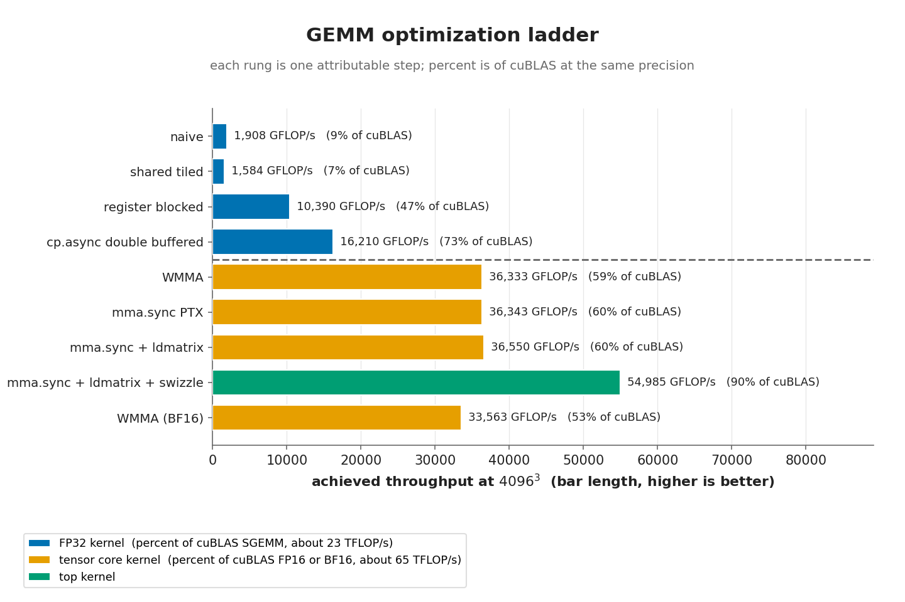
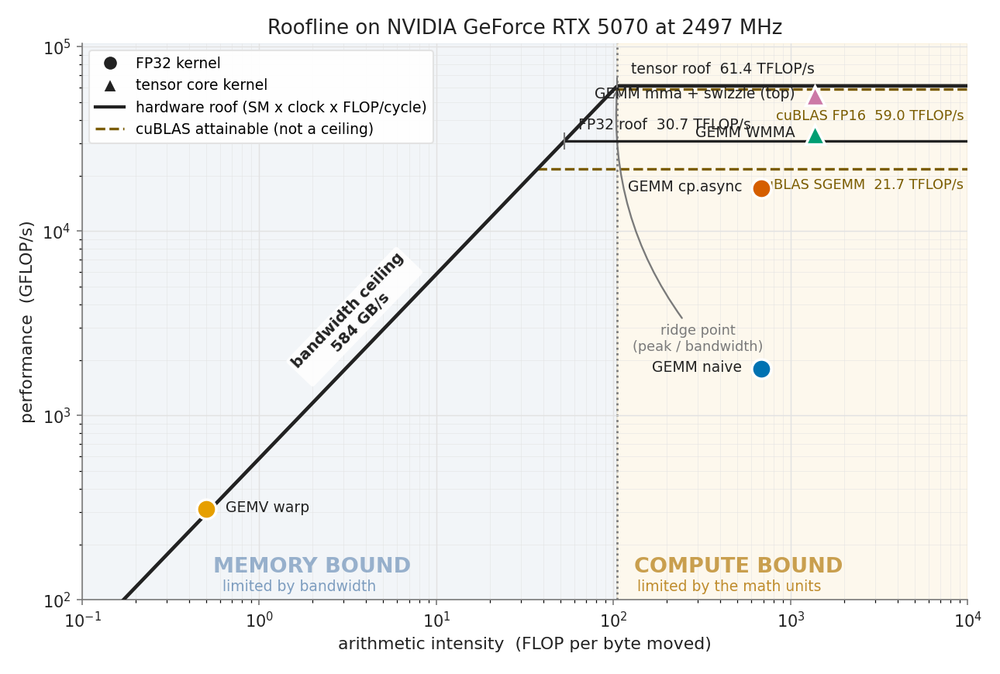
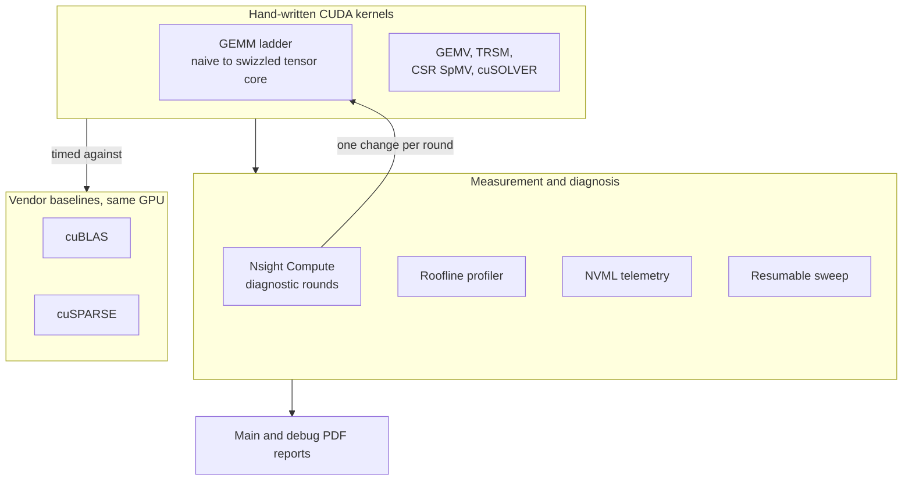

# CUDA Kernel Library

> A hand-written CUDA linear-algebra library, driven from a naive GEMM to a
> **compute-bound tensor-core kernel** on a single NVIDIA RTX 5070. As a percent of
> cuBLAS FP16 the top kernel runs at **63.5% at 1024^3, 80.5% at 2048^3, 89.9% at
> 4096^3 and 88.9% at 8192^3, a geometric mean of 79.9% across the swept range**.
> Every performance number is my kernel versus the vendor library (cuBLAS, or
> cuSPARSE for sparse) on the **same GPU, in the same process**, and every
> optimization step is justified by Nsight Compute profiling.


-76B900.svg)


**Author: Olajide Badejo**

---

## Using the library

Install it once, then four lines of CMake:

```cmake
find_package(CKL REQUIRED)

add_executable(my_app main.cpp)
target_link_libraries(my_app PRIVATE ckl::ckl)
```

`add_subdirectory` and pkg-config work too, and there is a C99 ABI with no CUDA
headers in it for callers who do not want the toolkit. Integration, a complete
first program, and the load-bearing contracts (synchronous versus asynchronous,
thread safety, alignment, aliasing, error handling, both layout conventions) are
in [`docs/using.md`](docs/using.md). Toolchain and build options are in
[`docs/building.md`](docs/building.md); calling it from Fortran is in
[`docs/fortran.md`](docs/fortran.md). Four runnable programs live in
[`examples/`](examples/).

## What this project demonstrates

- A GEMM kernel taken from a fair naive baseline to **compute bound** on the
  Blackwell tensor cores, one profiler-guided change at a time.
- The full optimization toolkit applied for real: shared-memory tiling, register
  blocking, `cp.async` double buffering, WMMA, raw `mma.sync` PTX, `ldmatrix`, and
  a shared-memory **swizzle** that reduced bank conflicts from 219M to 33.7M and
  passed the compute-bound gate.
- Honest engineering: a plausible optimization that measured *worse* was reverted
  and written up, not hidden.
- A complete supporting library (GEMV, TRSM, CSR SpMV, cuSOLVER), a roofline built
  on hardware ceilings rather than on a vendor library, NVML thermal-throttle
  gating, a clock-locked resumable benchmark sweep, CI, and two automatically
  generated PDF reports.
- A corrections register, [`docs/CORRECTIONS.md`](docs/CORRECTIONS.md), where I
  audit my own published claims against my own data and write down what did not
  survive.

## Headline result: the GEMM optimization ladder

Each rung isolates one technique so the speedup can be attributed to a cause. The
chart is percent of cuBLAS against shape, every rung at every swept size, because
a single shape hides the fact that the curve is not flat. The percent is of cuBLAS
**at the same precision** (FP32 kernels vs cuBLAS SGEMM, tensor kernels vs cuBLAS
FP16/BF16), so the two groups are not comparable as absolute speed.



The decisive moves: **register blocking** (naive-beating tiling was actually
slower on this cache-rich GPU), then feeding the tensor cores through a **swizzled
shared layout**. The top FP16 kernel reaches **54,985 GFLOP/s at 4096^3, 89.9% of
cuBLAS**, and 58,060 GFLOP/s at 8192^3, 88.9% of cuBLAS. The curve is not flat: at
1024^3 it is 63.5% and at 2048^3 it is 80.5%, so the honest single figure is the
geometric mean across the swept shapes, 79.9%.

## The roofline: why each kernel hits its limit

The compute roofs are hardware, not cuBLAS: 48 SMs times the SM clock times 512
FLOP per cycle for FP16 inputs with FP32 accumulate, and 256 FLOP per cycle for
FP32. At the 2842 MHz the GPU held during the run that is a **69.8 TFLOP/s tensor
roof** and a **34.9 TFLOP/s FP32 roof**, against a **581 GB/s** measured streaming
bandwidth. cuBLAS is drawn as a separate dashed attainable line, because a vendor
library is a competitor, not a ceiling: it reaches 67.9 TFLOP/s FP16 (97.2% of the
roof) and 23.7 TFLOP/s SGEMM (67.8%).

GEMM sits far right of the ridge (compute bound); GEMV sits on the bandwidth
diagonal (memory bound), exactly as the model predicts.



The top kernel is **verified compute bound**: Nsight Compute Speed of Light shows
the tensor pipe at 83% against the memory system at 30%.

## Architecture


```mermaid
flowchart TB
    subgraph K["Hand-written CUDA kernels"]
        G["GEMM ladder<br/>naive to swizzled tensor core"]
        F["GEMV, TRSM,<br/>CSR SpMV, cuSOLVER"]
    end
    subgraph H["Measurement and diagnosis"]
        NCU["Nsight Compute<br/>diagnostic rounds"]
        RF["Roofline profiler"]
        NV["NVML telemetry"]
        SW["Resumable sweep"]
    end
    subgraph B["Vendor baselines, same GPU"]
        CB["cuBLAS"]
        CS["cuSPARSE"]
    end
    K -->|timed against| B
    K --> H
    NCU -->|one change per round| G
    H --> R["Main and debug PDF reports"]
```

## Results at a glance (this RTX 5070)

All at 4096^3, from `summary.csv`:

| GEMM rung | precision | GFLOP/s | % of cuBLAS |
|---|---|---|---|
| naive | FP32 | 1,908 | 8.7 |
| register blocked | FP32 | 10,390 | 47.2 |
| cp.async double buffered | FP32 | 16,210 | 73.5 |
| WMMA | FP16 | 36,333 | 59.3 |
| **mma.sync + ldmatrix + swizzle (top)** | **FP16** | **54,985** | **89.9** |

| supporting family | shape | GFLOP/s | % of vendor | baseline | note |
|---|---|---|---|---|---|
| GEMV vectorized | 8192 sq | 308.1 | 101.6 | cuBLAS SGEMV | memory bound, 616 GB/s effective |
| GEMV warp | 8192 sq | 304.0 | 99.9 | cuBLAS SGEMV | memory bound |
| CSR SpMV warp per row | 131072 | 93.6 | retracted, see A2 | cuSPARSE | 1.6x the naive kernel, skewed-degree matrix |
| CSR SpMV naive | 131072 | 57.5 | retracted, see A2 | cuSPARSE | one thread per row |
| TRSM blocked | 2048 x 256 | 381.3 | 31.8 | cuBLAS STRSM | correct to 1e-7, but a third of the vendor's speed |
| TRSM naive | 2048 x 256 | 7.8 | 0.7 | cuBLAS STRSM | column at a time, kept as the honest baseline |
| cuSOLVER LU / Cholesky | 1024 | not timed | not timed | vendor path | residual 5.6e-7 / 4.3e-7, RAII wrapper |

These figures predate clock locking, so the GPU ran at anywhere from 1042 to 2880
MHz across the sweep, and they carry rewritten-history provenance: the commit hash
recorded in every row no longer resolves in this repository. Both defects, and
everything else I found auditing my own claims, are tracked in
[`docs/CORRECTIONS.md`](docs/CORRECTIONS.md). Re-measurement under a locked clock
is pending; until it lands, read every percent above as provisional.

Full per-shape data with clocks, temperature, and throttle flags:
[`experiments/results/summary.csv`](experiments/results/summary.csv).

## Reports (PDF)

The PDFs are not committed to the tree. They are built from the committed results
files and attached to each GitHub release, so a link here points at the release
asset rather than at a binary in `git`:

- **[main_report.pdf](../../releases/latest)** (attached to the release) - the
  design and optimization narrative, related work, the negative result, the
  numerical accuracy model, roofline analysis, limitations, and a reproducibility
  statement, all generated from the live data.
- **[debug_report.pdf](../../releases/latest)** (attached to the release) - the
  dated engineering log: toolchain fights, the WSL2 profiler-permission fix, the
  diagnostic round that failed and was reverted, and the audit of my own claims.

Build them locally with `make report`, which regenerates every figure and table
from `experiments/results/` and writes `report/build/main.pdf` and
`report/build/debug.pdf`. It needs no GPU and no CUDA toolkit.

## The method

The core of the project is a loop, not a single kernel. After each rung: run
Nsight Compute, name the top limiter, state a hypothesis, apply **exactly one**
change, re-measure. Nine rounds are recorded in
[`docs/DIAGNOSTIC_LOG.md`](docs/DIAGNOSTIC_LOG.md). Seven of them point at a
committed `ncu` text page under `experiments/results/ncu/`; rounds 5 and 8 do not,
which is defect A6 in [`docs/CORRECTIONS.md`](docs/CORRECTIONS.md). Percent of
cuBLAS on the same device is the headline used against a vendor library, because
it cancels the hardware out of the claim; the roofline uses the hardware roof
instead, so "percent of roof" and "percent of cuBLAS" stay two different
questions.

## Reproduce

Requires an NVIDIA GPU with a CUDA 13.3 driver (this repo targets sm_120), built
inside WSL2 Ubuntu.

```sh
make setup      # configure (CMake + Ninja, sm_120)
make build      # compile; zero warnings is a gate
make test       # correctness vs cuBLAS/cuSPARSE/CPU (needs a GPU)
make sweep      # full benchmark sweep -> experiments/results/summary.csv
make roofline   # measure the ceilings and render the roofline figure
make report     # regenerate figures/tables and build both PDFs
make all        # build + test + sweep + report + style gate
```

`make sweep` locks the graphics clock before it measures anything and refuses to
run if it cannot, so the rows in a sweep are comparable with each other. Every
result carries the commit that produced it, and `make check-style` runs
`scripts/check_provenance.py`, which fails if any recorded hash no longer resolves
in git. The v1 hashes do not resolve, for the reason recorded in
[`docs/CORRECTIONS.md`](docs/CORRECTIONS.md), and they are listed as a standing
debt in `experiments/results/legacy_hashes.txt`. Nothing is hand-copied into the
reports. See [`docs/`](docs/) for per-component notes,
[`docs/DIAGNOSTIC_LOG.md`](docs/DIAGNOSTIC_LOG.md) for the profiling rounds, and
[`docs/ENGINEERING_LOG.md`](docs/ENGINEERING_LOG.md) for the dated build log.

## Target machine

RTX 5070 (Blackwell GB205, compute capability 12.0, sm_120, 48 SMs, 12 GB GDDR7),
CUDA Toolkit 13.3, host compiler g++-14.3, built and run inside WSL2 Ubuntu. The
system GCC is 15.2, but nvcc 13.3 cannot parse its libstdc++, so the build pins
g++-14; [`docs/building.md`](docs/building.md) has the detail. Measured ceilings
are captured at build time by `./build/tools/ckl_device_probe` and used everywhere
in place of the datasheet.

## License and how this was built

MIT, sole author Olajide Badejo. See [LICENSE](LICENSE).

I built this project with AI agent tooling (Claude Code) driven by specifications
I wrote. The design decisions, the hardware targets, the diagnostic rounds, and
every claim in this README are mine, and I am responsible for all of them.
